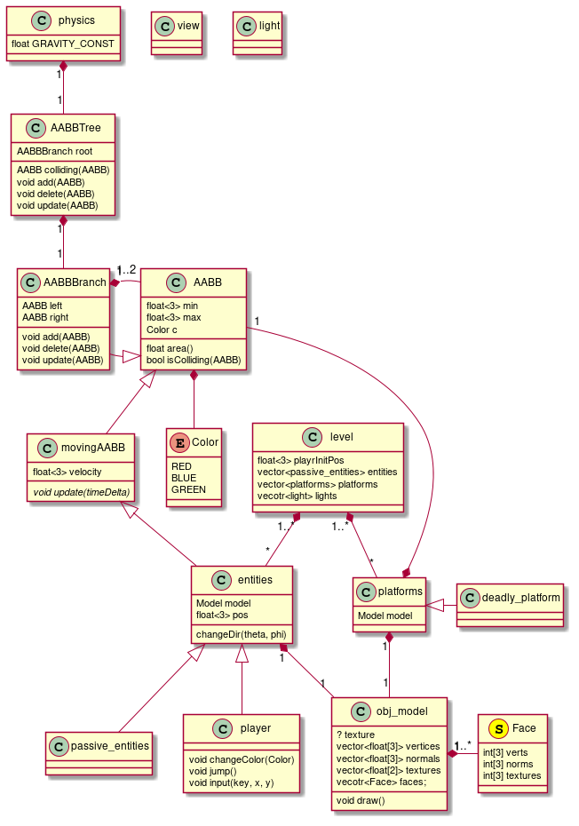

# Instructions

## Installation

You will require to install [freeimg](https://freeimage.sourceforge.io/) library.

### Freeimg installation instructions

-   Linus
    -   `sudo apt-get install libfreeimage3 libfreeimage-dev`
    -   `sudo pacman -S freeimage`
-   Mac OSX
    1.  Use [homebrew](https://www.digitalocean.com/community/tutorials/how-to-install-and-use-homebrew-on-macos)
    2.  `brew install freeimage`

### Compiling and running the program

Use `make` to compile the program or `make run` to compile and run. Must be used in the same location as this README.

## Known issues

-   The model scales are horrible
-   The player model has some detection issues

    Does not follow model guidelines for the project, thus is causing collision resolving issues. A simple cuboid does not cause these issues.
-   The textures do not render

## Controls

-   Movement is done thought conventional `W A S D` controls
-   <kbd> SPC </kbd> is used for jumping
-   Mouse is used to look around
-   <kbd> <down-mouse-1> </kbd> is used to bring the colour menu. Colour is set depending on where the mouse is on the screen when the button is released.
    -   Some platforms and work objects are visible and intractable only when you current colour is the same as their colour
    -   The available colours are `RED`, `BLUE`, and `GREEN`.
-   <kbd> <escape> </kbd> is used to pause the game.

# Class Diagram

-   Update UML diagram

NOTE: Some aspects of this diagram differ from the actual implementation.

# Collision

## AABBs

For collision we are using [AABBs](https://developer.mozilla.org/en-US/docs/Games/Techniques/3D_collision_detection)(Axis Aligned Bounding Box). They are simply a rectangle, cuboid in 3D, that totally encompasses the colliding object while being very quick to check collisions for. They are supposed to serve as initial collision detection followed by more complex collision detection algorithm, if the AABBs do collide. In our implementation, we are only using AABBs as we do not have an algorithm to check vertex/model level collision.

The base class AABB serves as the common implementation of all physics objects in the project.

It also directly inherited by the Platform class, as they are static physics object.

### Moving AABB

Very similar to AABB, but they also have velocity and an update function. The update serves to update the state of the MovingAABB. This is inherited by all entities. They can also be used by moving platforms, when those are implemented.

## AABB Tree and [branches](https://www.azurefromthetrenches.com/introductory-guide-to-aabb-tree-collision-detection/)

An AABB tree serves as an efficient implementation for collision detection between all AABB objects in the world, a balanced binary tree. A tree consists of a single AABBBranch which consists of two AABB objects, these AABB objects can be any type of AABB, including an AABBBranch.

The top branch is the tree. The branch serves to update the AABBs in the tree, delete, add, and detect collision with other AABB objects; not with AABBBranch objects.

## A note about use of AABBs

For more complex models, it is possible to have multiple AABBs. Essentially, and object would be represented by an AABB tree which doesn't detect internal collision. For example, the player would have an AABB between each joint.

This could be done in two different ways. The first is to manually create the AABB tree for each complex model.

The second is when exporting the obj model to export it in groups. Each group will end up having its own AABB inside of the entity AABB tree. This would be the better implantation as it will allow for more accurate collision detection while only utilising AABBs, or some variant that can rotate.

# Model and obj files

A model class handles all model related operations. It responsible for loading the obj model and returning the relevant details to create an encompassing AABB. It is a field in all classes which should have a 3D representation in the world.

# Camera

The camera is part of the player class. It uses the player's position and rotation to place itself in the world and look in the correct direction. The header for the camera has some constants which allows us to offset the position and rotation of the camera for a better experience.

# Current state

At the moment, the program has no makefile. It is possible to be run, but there has been no tests if it does. We have only been working on the backend of it, i.e we have just implemented the engines and are working on integrating it all together.

# Next step

## Overlay and UI

We need a way to draw 2D objects relative to the viewport and unrelated to the global coordinates. I believe that `glutOverlayDisplayFunc` would be the best solution for this, but we need some more research in how to use it.

### Main Menu

-   State "CANCELLED"  from              [2020-12-07 Mon 02:15] 
    Not enough time implement a main menu. Requires to define game states.

A main menu would used to select and load specific level.

### In-game menu

This the menu that will allow the user to quit, resume, etc. It is used to pause the game.

### Colour selector

A menu that can be called mid-game to change the colour of the world.

## Drawing textures

-   Store textures

## Special colliders

### Collider to indicate end location of the level

This is not a visible part of the world. Simply a volume where, if the player collides with it, indicates the completion of the level.

# Developers

-   Omar Alkersh
-   Youssef Mikhail
